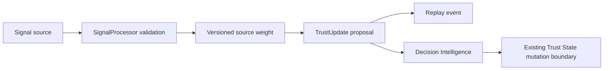

# Continuous Trust

Continuous Trust turns new identity, device, communication, provider, browser, location, behaviour, policy, and AI-agent signals into explainable trust-update proposals.

## Pipeline

`SignalProcessor` rejects unknown sources, non-finite values, values outside −100 to 100, and confidence outside 0–1. `SignalPipeline` applies explicit source weights and clamps the proposed trust value to 0–100.

The default weights are code-visible and testable. They are not learned silently. A future policy version may supply tenant-specific weights through the same `SignalWeights` contract.

## Persistence and security

`trust_signals` stores the normalized observation. `trust_updates` stores prior value, resulting value, delta, confidence, and reason. `record_trust_signal_v1` requires the service role, verifies that the signal, update, and replay event share the same tenant and identity, and writes all three atomically.

Authenticated users receive read-only access through tenant RLS. Anonymous access and direct authenticated writes are revoked. Signals and updates are append-only.

## Provider integration

`TrustProvider` standardizes:

- `verify()`
- `health()`
- `confidence()`
- `cost()`
- `latency()`

The normalized result contains no raw provider payload. Current canonical provider observations are backfilled into `provider_results`, and future observations are projected automatically. World ID remains inconclusive unless server verification exists, preserving the existing fail-closed rule.
