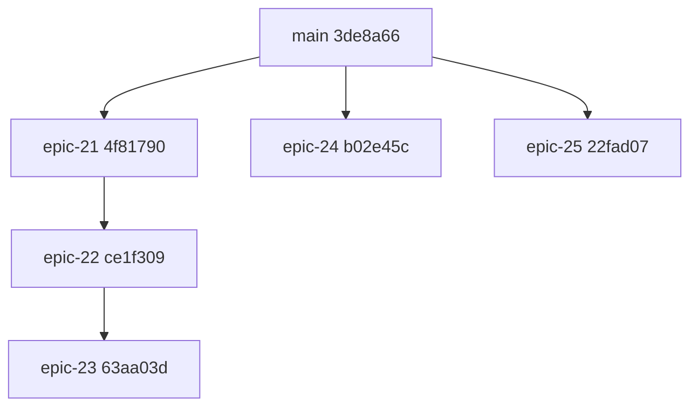
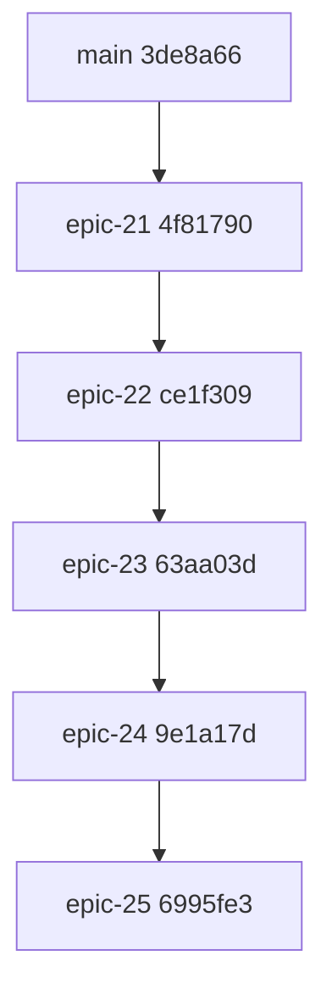

# CYBER SENTINELS - EPIC 21-25 RELEASE CHAIN AUDIT (POST-REPAIR)

Date: 2026-07-24
Repository: C:\Users\emeae\Desktop\cyber-sentinels-clean
Working branch: epic-25-enterprise-trust-centre
Baseline main: 3de8a66
Mode: Controlled local repair only (no push, no remote modification)

## 1. Backup branch names and SHAs

Created before any repair:

- backup/epic-21-before-release-repair -> 4f81790
- backup/epic-22-before-release-repair -> ce1f309
- backup/epic-23-before-release-repair -> 63aa03d
- backup/epic-24-before-release-repair -> b02e45c
- backup/epic-25-before-release-repair -> 22fad07

Audit file preservation before branch rewrite activity:

- Source: docs/EPIC-21-25-RELEASE-CHAIN-AUDIT.md (untracked)
- Safe copy: temp/release-repair-backup/EPIC-21-25-RELEASE-CHAIN-AUDIT.pre-repair.md
- SHA256 (source and copy): 61F3F0070B943EB15AD52762E18FF7BEA498A1200281E51F34EC65EA871C...

## 2. Original branch topology

Original local topology at start:



## 3. Repaired branch topology

Repairs performed locally:

- Rebasing EPIC 24 onto EPIC 23 chain
- Rebasing EPIC 25 onto repaired EPIC 24
- Resolving rebase conflicts and migration collisions

Current repaired topology proof:

- epic23 -> epic24: YES
- epic24 -> epic25: YES
- main -> epic21: YES

Current repaired heads:

- epic-21-enterprise-trust-graph -> 4f81790
- epic-22-trust-dna -> ce1f309
- epic-23-replay -> 63aa03d
- epic-24-continuous-trust-engine -> 9e1a17d
- epic-25-enterprise-trust-centre -> 6995fe3

Repaired chain:



## 4. Exact migration renumbering

Renumbering done locally:

- supabase/migrations/202607240001_continuous_trust_engine.sql
  -> supabase/migrations/202607240003_continuous_trust_engine.sql
- supabase/migrations/202607240001_enterprise_trust_centre.sql
  -> supabase/migrations/202607240004_enterprise_trust_centre.sql

Final chain migration sequence for EPIC 21-25:

- 202607230001_trust_intelligence_engine.sql
- 202607230002_enterprise_trust_graph.sql
- 202607240001_trust_dna_engine.sql
- 202607240002_replay_timeline_engine.sql
- 202607240003_continuous_trust_engine.sql
- 202607240004_enterprise_trust_centre.sql

## 5. SQL collision resolutions

Resolved collisions:

1. Duplicate table name collision:
- public.trust_signals existed in both:
  - 202607230001_trust_intelligence_engine.sql
  - 202607240001_continuous_trust_engine.sql (now 202607240003)

Resolution:
- EPIC 24 was selected as canonical authority for runtime continuous signals.
- In 202607230001_trust_intelligence_engine.sql:
  - public.trust_signals renamed to public.trust_intelligence_signals
  - public.trust_updates renamed to public.trust_intelligence_updates
  - dependent foreign keys/indexes/policies/triggers/function inserts updated accordingly

2. Duplicate trigger name collision:
- trust_signals_append_only existed in both migrations.

Resolution:
- EPIC 21 migration trigger renamed to trust_intelligence_signals_append_only.
- EPIC 21 update trigger renamed to trust_intelligence_updates_append_only.

3. Duplicate numeric migration prefix collision:
- multiple 202607240001 files existed.

Resolution:
- renumbered to unique 202607240003 and 202607240004 as listed above.

Post-repair collision checks:

- Duplicate EPIC table names across 21-25 migrations: none
- Duplicate EPIC trigger names across 21-25 migrations: none
- Duplicate EPIC migration numeric prefixes: none

## 6. API collision resolutions

1. package.json conflict during EPIC 24 and EPIC 25 rebases was resolved to one canonical test pipeline containing both:
- test:continuous-trust-engine
- test:trust-centre
- existing trust-intelligence/trust-graph/trust-dna/replay coverage

2. No duplicate path overwrite was introduced by migration repairs.

3. Canonical API authority decisions preserved:
- Continuous Trust runtime signal authority remains EPIC 24 implementation.
- Enterprise Trust Centre remains EPIC 25 collaboration boundary, layered on runtime state.

## 7. Canonical services selected

Selected canonical authorities:

- Trust Graph: EPIC 21/22/23 chain implementation
- Trust DNA: EPIC 22/23 implementation
- Replay: EPIC 23 implementation
- Continuous Trust signal lifecycle and state transitions: EPIC 24 implementation
- Enterprise Trust Centre collaboration workflows: EPIC 25 implementation
- Runtime trust signal table authority: EPIC 24 (public.trust_signals)
- Trust-intelligence historical signal capture: EPIC 21 renamed tables (public.trust_intelligence_signals, public.trust_intelligence_updates)

## 8. Files changed during repair

Direct repair edits (not counting ordinary rebase replayed branch content):

- package.json
- docs/CONTINUOUS-TRUST.md
- docs/EPIC-24-CONTINUOUS-TRUST-REPORT.md
- docs/EPIC-25-REPORT.md
- supabase/migrations/202607230001_trust_intelligence_engine.sql
- supabase/migrations/202607240003_continuous_trust_engine.sql (renamed from 202607240001)
- supabase/migrations/202607240004_enterprise_trust_centre.sql (renamed from 202607240001)
- tests/rls/trust-intelligence.test.mjs
- tests/rls/continuous-trust-engine-epic24.test.mjs
- tests/enterprise-trust-centre.test.mjs

## 9. Test results

Executed on repaired EPIC 25 chain:

- npm run lint -> PASS
- npm run typecheck -> PASS
- npm test -> PASS
- npm run build -> PASS

Focused suites executed:

- npm run test:enterprise-trust-graph -> PASS
- npm run test:trust-dna -> PASS
- npm run test:replay -> PASS
- npm run test:continuous-trust -> PASS
- npm run test:continuous-trust-engine -> PASS
- npm run test:trust-centre -> PASS

RLS and contract verification:

- node --test tests/rls/*.mjs -> 65 PASS, 1 FAIL (env-gated test)
- Failing file: tests/rls/rc6-denial.test.mjs
- Reason: required runtime env not configured locally for live cross-tenant denial check.

Additional API/integration contract run:

- enterprise-trust-graph-api, trust-dna-api, replay-api-ui,
  continuous-trust-api-epic24, trust-intelligence-api,
  trust-event-api, trust-dna-integration, replay-integration,
  trust-intelligence-integration -> PASS

## 10. Build results

- next build on repaired EPIC 25 chain -> PASS
- Route generation and type checks completed successfully.

## 11. Merge simulation result

Temporary branch created from main:

- temp/release-chain-merge-validation-20260724

Simulated merges executed in exact release order:

1. merge epic-21-enterprise-trust-graph
2. merge epic-22-trust-dna
3. merge epic-23-replay
4. merge epic-24-continuous-trust-engine
5. merge epic-25-enterprise-trust-centre

Result:

- All merges completed without merge conflicts.
- Temporary branch tip: ff6ea45
- Temporary branch deleted after recording result.

## 12. Exact future push commands

Do not run until human approval.

```bash
git checkout epic-24-continuous-trust-engine
git push --force-with-lease origin epic-24-continuous-trust-engine

git checkout epic-25-enterprise-trust-centre
git push --force-with-lease origin epic-25-enterprise-trust-centre
```

No push required for EPIC 21-23 (unchanged tips).

## 13. Exact PR retargeting or replacement plan

No PR closure or replacement required.

Retarget plan:

1. EPIC 21 PR base -> main
2. EPIC 22 PR base -> epic-21-enterprise-trust-graph
3. EPIC 23 PR base -> epic-22-trust-dna
4. EPIC 24 PR base -> epic-23-replay
5. EPIC 25 PR base -> epic-24-continuous-trust-engine

If only EPIC 24 and EPIC 25 draft PRs currently exist and target main:

- retarget EPIC 24 PR to epic-23-replay
- retarget EPIC 25 PR to epic-24-continuous-trust-engine

## 14. Exact recommended merge order

Recommended release chain merge order:

1. epic-21-enterprise-trust-graph
2. epic-22-trust-dna
3. epic-23-replay
4. epic-24-continuous-trust-engine
5. epic-25-enterprise-trust-centre

## 15. Rollback instructions

Local rollback options:

1. Restore EPIC 24 to pre-repair state:
```bash
git checkout epic-24-continuous-trust-engine
git reset --hard backup/epic-24-before-release-repair
```

2. Restore EPIC 25 to pre-repair state:
```bash
git checkout epic-25-enterprise-trust-centre
git reset --hard backup/epic-25-before-release-repair
```

3. Restore all EPIC branches to backups if required:
```bash
git checkout epic-21-enterprise-trust-graph
git reset --hard backup/epic-21-before-release-repair

git checkout epic-22-trust-dna
git reset --hard backup/epic-22-before-release-repair

git checkout epic-23-replay
git reset --hard backup/epic-23-before-release-repair

git checkout epic-24-continuous-trust-engine
git reset --hard backup/epic-24-before-release-repair

git checkout epic-25-enterprise-trust-centre
git reset --hard backup/epic-25-before-release-repair
```

## 16. Remaining risks

1. Environment-gated RLS denial test requires live credentials/JWT context and tenant IDs:
- tests/rls/rc6-denial.test.mjs cannot pass in this workstation context without those secrets and runtime values.

2. Rebases have changed local branch history for EPIC 24 and EPIC 25:
- Any future remote update requires explicit force-with-lease after approval.

3. There is still product-level coexistence between /trust-center and /trust-centre routes.
- This is not a merge blocker, but should be addressed in a follow-up unification pass.

RELEASE CHAIN BLOCKED
