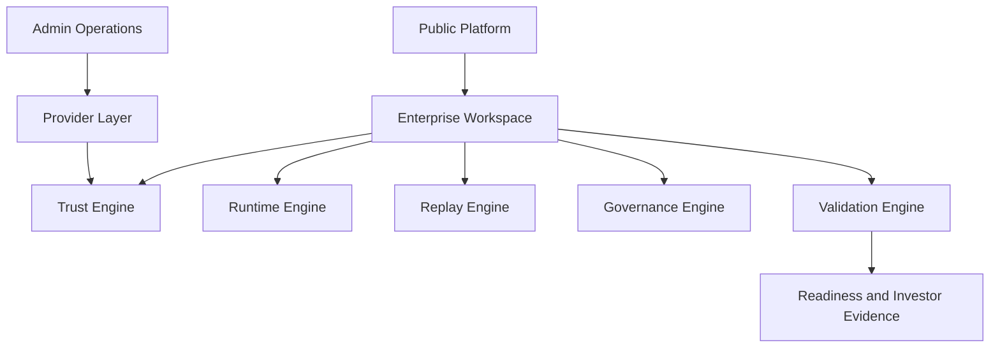
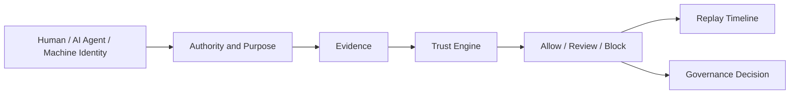
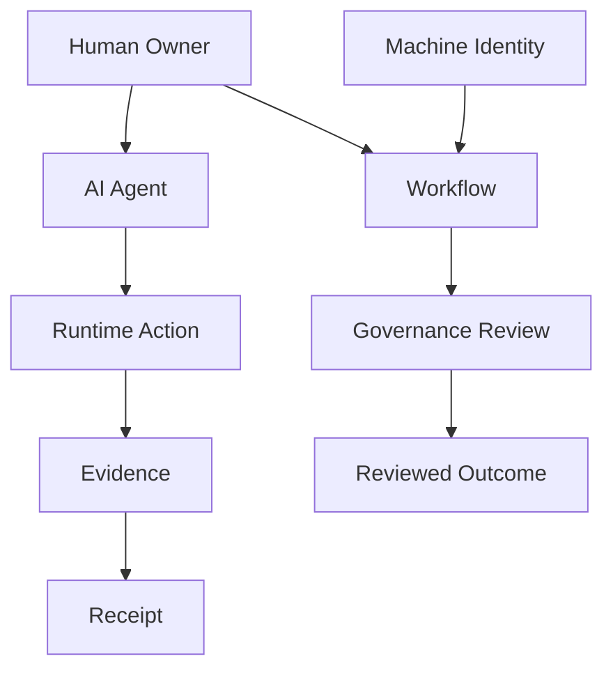
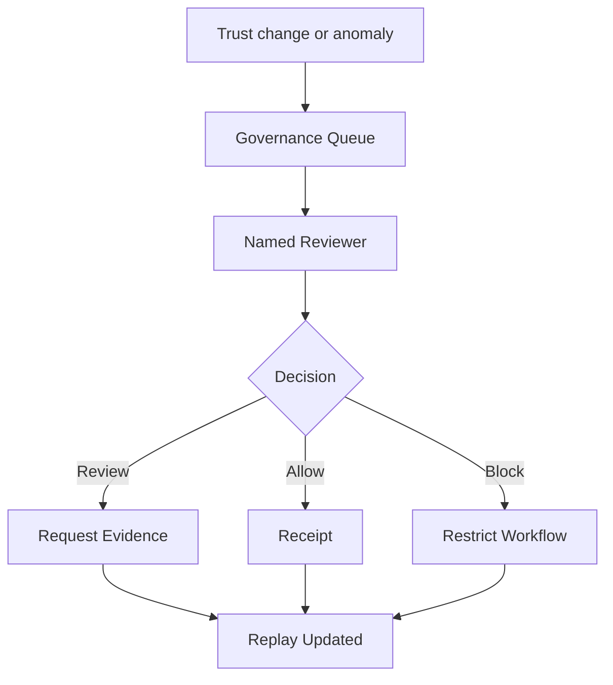
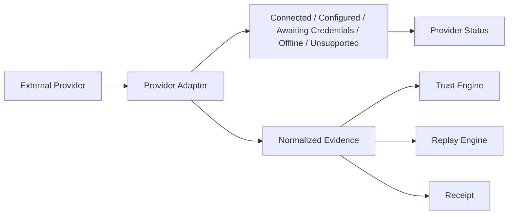

# Epic 02 Architecture Diagrams

Last updated: 2026-07-08

## Platform



## Trust Flow



## Entity Graph



## Replay Flow

```mermaid
sequenceDiagram
  participant Actor
  participant Trust as Trust Engine
  participant Runtime as Runtime Engine
  participant Replay as Replay Engine
  participant Gov as Governance Engine
  Actor->>Runtime: action observed
  Runtime->>Trust: runtime and evidence context
  Trust->>Replay: trust transition recorded
  Replay->>Gov: replay-linked escalation context
  Gov->>Replay: reviewed outcome and rationale
```

## Governance Flow



## Provider Layer


