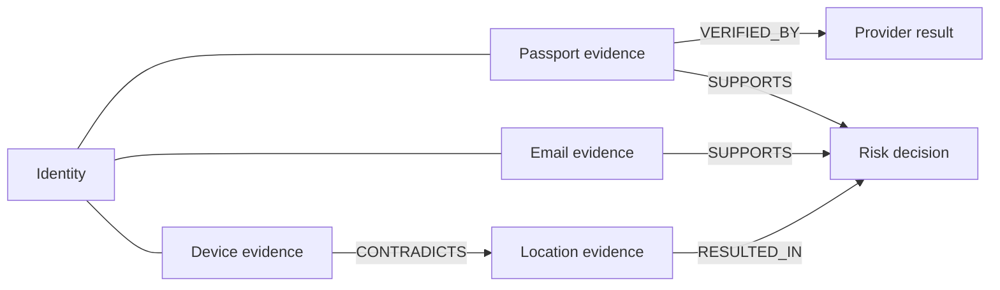

# Evidence Graph

The Evidence Graph turns normalized verification evidence into explainable, tenant-isolated nodes and relationships.

## Contracts

`EvidenceNode` retains identity, type, status, confidence, timestamp, source, verifier, integrity hash, validity, and safe metadata. Sensitive payload keys are removed before domain use and raw provider payloads remain in their authoritative stores.

`EvidenceRelationship` supports:

- `SUPPORTS`
- `CONTRADICTS`
- `DERIVED_FROM`
- `OBSERVED_BY`
- `VERIFIED_BY`
- `APPLIES_TO`
- `SUPERSEDES`
- `REVOKES`
- `RESULTED_IN`

## Service behavior

`EvidenceGraphService` depends only on `EvidenceRepository`, allowing database and in-memory implementations. Reads are bounded to 500 nodes. Returned nodes and edges are filtered again by tenant, and relationships are returned only when both endpoints exist in the selected tenant graph.

The Supabase repository applies `tenant_id` to every query. The database reinforces that rule with composite `(tenant_id, node_id)` foreign keys for both relationship endpoints.

## Data integration

The migration backfills current canonical `evidence_objects` and installs an insert projection trigger. Evidence types are mapped conservatively. Unknown evidence maps to `HUMAN` with its original evidence label preserved; it is not promoted beyond its existing assurance or result.

Provider observations continue to materialize canonical evidence through the pre-existing EPIC 18 flow. EPIC 20 consumes that evidence rather than replacing it.

## APIs

- `/api/evidence/{id}`
- `/api/evidence/graph/{identity}?limit=200`
- `/api/evidence/history/{identity}?limit=200`

All require authentication, enterprise membership, a tenant header, validated references, and private no-store responses.
