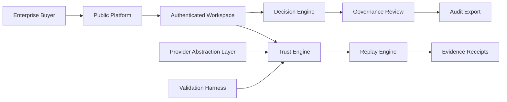
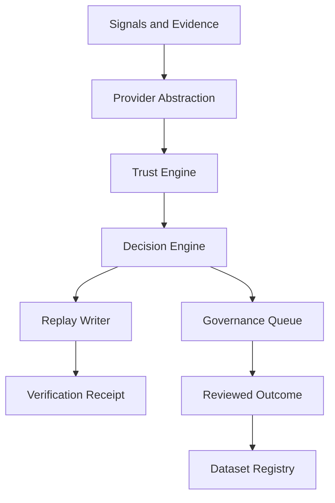

# Investor Pack

Last updated: 2026-07-08

## Architecture Diagram

## Engine Diagram

## Provider Map

| Provider family | Enterprise value | Canonical surface |
| --- | --- | --- |
| Identity | Verify actor, account, and organization context. | Trust Engine, Replay, Governance. |
| Media provenance | Prove origin and tamper state. | Verification Replay, Evidence Receipts. |
| Deepfake | Add media/session risk signal. | Provider Status, Governance Review. |
| ATS | Connect hiring workflow evidence to enterprise systems. | ATS webhooks, receipt export. |
| SSO | Enterprise access and tenant control. | Auth, admin audit, identity governance. |
| C2PA | Content chain-of-custody. | Media provenance report and replay. |

## Readiness Scorecard

| Dimension | Status | Note |
| --- | --- | --- |
| Platform consolidation | Ready with follow-up | Navigation and route map now align to canonical hubs. |
| Security model | Caution | Auth/admin protections exist; MFA/SSO/rate-limit verification remains production work. |
| Provider readiness | Caution | Live integrations must be proven through abstraction and reviewed evidence. |
| Validation maturity | Caution | Harness direction is strong; publish metrics only after ground-truth datasets. |
| Demo readiness | Ready with guardrails | Use bounded enterprise demo journeys and avoid live-provider overclaims. |
| Performance | Caution | Profile engine/provider/dashboard paths under realistic workloads. |

## Security Model

- Public surface: buyer pages, trust center, pricing, demos, legal and help.
- Enterprise surface: authenticated dashboards, replay, receipts, evidence, governance, agents and workflows.
- Admin surface: allowlisted admin tools, provider status, runtime validation, repair, benchmarking and reviews.
- Provider surface: env-bound credentials, normalized output, fail-closed handling, evidence persistence.
- Audit surface: replay timeline, receipts, authorization lineage, governance decisions, exports.

## Trust Lifecycle

1. Register actor, agent, session or workflow.
2. Collect evidence and provider signals.
3. Evaluate trust state with bounded confidence.
4. Route decision and governance review.
5. Write replay and receipt evidence.
6. Export audit trail and feed reviewed outcomes into validation.
7. Re-evaluate posture as new evidence arrives.

## Validation Maturity

Current maturity is foundation-stage: scenario coverage, reviewer outcomes, provider agreement and confidence calibration are the right primitives. Investor-facing metrics should remain readiness metrics until a versioned dataset registry and reviewed ground truth support precision, recall and calibration claims.

## Roadmap

| Horizon | Work |
| --- | --- |
| 0-30 days | Finish route consolidation redirects, provider state audit, dataset registry schema, demo scripts. |
| 30-60 days | Live identity/media/ATS provider proofs, SSO plan, performance profiling, rate-limit audit. |
| 60-90 days | Publish validation scorecard with reviewed datasets, enterprise SSO pilot, C2PA evidence chain, investor demo package. |
