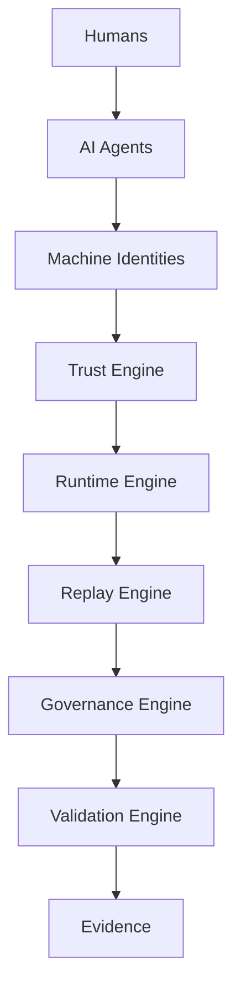

# Platform Information Architecture

Last updated: 2026-07-08

## Purpose

Cyber Sentinels is organized as an enterprise trust control plane for humans, AI agents, machine identities and regulated workflows. The platform should consolidate capabilities under clear product hierarchy instead of adding more standalone routes, pages or logic paths.

## Public Navigation

| Navigation item | Canonical route | Role |
| --- | --- | --- |
| Platform | `/platform` | Product architecture, trust engines and operating model. |
| Solutions | `/enterprise/hiring-security`, `/enterprise/agent-governance`, `/verification-replay`, `/trust/data-sovereignty` | Workflow-specific enterprise entry points. |
| Enterprise | `/enterprise` | Buyer, pilot, readiness and access path. |
| Developers | `/developers` | Integration documentation and protected API-key access. |
| Pricing | `/pricing` | Commercial packaging and upgrade intent. |
| Resources | `/demo`, `/help`, `/security`, `/about` | Evaluation, support and company/security context. |
| Trust Center | `/trust` | Public trust, governance, security and methodology story. |
| Login | `/login` | Authenticated access. |

Everything else is nested, contextual, protected, admin-only, internal-only or legacy until merged.

## Product Hierarchy

1. Public platform story: landing, platform, solutions, enterprise, pricing, resources and trust center.
2. Enterprise workspace: dashboard, replay, receipts, evidence, governance, agents, workflows and posture.
3. Developer layer: docs, authentication, events, protected API keys and integration endpoints.
4. Admin operations: provider status, runtime validation, benchmarking, reviews, repair tools and support operations.
5. Internal/runtime APIs: trust execution, provider orchestration, provenance, receipts, audit, workflow and admin APIs.
6. Legacy concept routes: older trust graph, origin, reality, human-presence and detection pages retained but hidden until merged.

## Five Trust Engines

| Engine | Owns | Referenced by |
| --- | --- | --- |
| Trust Engine | Actor verification, authority, evidence, posture and confidence boundaries. | Platform, Trust Center, Enterprise, dashboard, verification and provider surfaces. |
| Runtime Engine | Execution state, permissions, live workflow context, provider state and kill-switch readiness. | Agent governance, workflow routes, admin runtime validation and demo journeys. |
| Replay Engine | Enterprise memory, chronology, receipts, evidence continuity and audit export. | Verification replay, receipts, trust reports, dashboard and demos. |
| Governance Engine | Review, escalation, intervention, approvals, blocks, rationale and ownership. | Enterprise, trust center, dashboard governance and admin reviews. |
| Validation Engine | Dataset registry, reviewed outcomes, calibration, precision, recall and provider agreement. | Admin benchmarking, validation dashboards, provider readiness and investor reporting. |

## Entity Model

| Entity | Trust question | Primary engine |
| --- | --- | --- |
| Human | Who acted and was the session still reliable? | Trust Engine |
| AI Agent | What was registered, permitted, observed and revocable? | Runtime Engine |
| Machine Identity | Under whose authority did the non-human actor operate? | Trust Engine |
| Workflow | What changed and why was the action allowed, reviewed or blocked? | Governance Engine |
| Evidence | Which signals, records and provenance supported the outcome? | Replay Engine |
| Reviewed Outcome | What did accountable review decide and how does it calibrate future trust? | Validation Engine |

## Architecture Diagram

## Enterprise Journey

1. Landing explains the trust-control-plane promise.
2. Platform explains the five-engine structure.
3. Solutions frame hiring security, AI agent governance, replay evidence and AI sovereignty as enterprise workflows.
4. Demo shows the end-to-end sequence: actor, runtime, evidence, replay, governance and outcome.
5. Enterprise explains readiness, ownership, workflows and access.
6. Pricing creates commercial next step.
7. Trust Center provides security, governance, methodology and public trust proof.
8. Dashboard and admin surfaces operationalize the same engines after authentication.

## Consolidation Rules

- Do not remove capabilities, APIs or admin tools during IA cleanup.
- Do not duplicate trust, provider, validation or replay logic.
- Hide internal and legacy surfaces from public navigation before considering redirects.
- Merge route families into canonical hubs only after link, auth and usage checks.
- Keep public copy centered on AI Trust Infrastructure, TrustOps, governance, replay and AI sovereignty.
