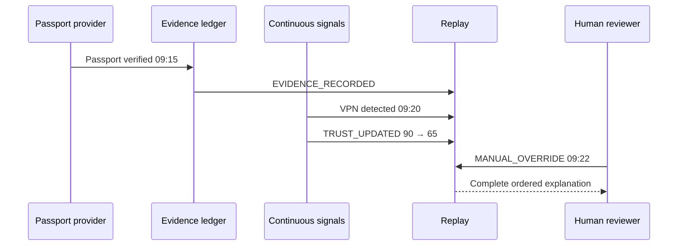

# Replay

Replay is an immutable audit chronology of how evidence, signals, risk, decisions, and human action changed trust.

`ReplayEngine` filters events by tenant and identity, normalizes timestamps, and orders by timestamp then event ID for deterministic ties. `ReplayRenderer` creates presentation-neutral rows with explicit trust changes.

Supported events are evidence recorded, signal received, trust updated, risk detected, manual override, and decision recorded. Events carry evidence references, source, confidence, prior/resulting trust, actor attribution, and safe metadata.

`replay_events` is append-only and tenant-scoped. The service-role signal function records the source signal, explainable update, and replay event atomically. It does not mutate authoritative Trust State.

The existing `/api/replay/{id}` contract remains available for retained replay session IDs. When a tenant header is supplied and no legacy replay session matches, the same route returns the EPIC 20 identity timeline. This preserves backward compatibility while satisfying the permanent identity Replay API.
