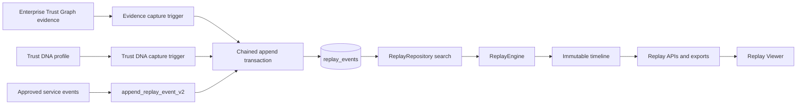

# Replay™ and Trust Timeline Engine

Replay is a forensic reconstruction of how retained evidence, provider outcomes, policy, risk, trust and accountable human action changed for an Enterprise Trust Graph entity. It is not application logging: it retains normalized domain events with explicit provenance, bounded metadata, before/after state and a per-entity integrity chain.

## Architecture



Authenticated reads use the tenant-scoped Supabase client and remain subject to RLS. New writes use a service-role-only append function or trusted database triggers. Direct authenticated writes remain revoked.

The EPIC 20 identity chronology remains available. EPIC 23 adds UUID `entity_id` timelines for Humans, AI Agents, Devices and Organisations without rewriting older events.

## Event lifecycle

1. A normalized evidence, Trust DNA or approved service-domain change occurs.
2. The database validates that the entity exists in the same tenant.
3. A per-entity transaction lock serializes event order.
4. The previous EPIC 23 event hash is loaded.
5. A SHA-256 hash is calculated from the normalized event and previous hash.
6. The event is appended to `replay_events`.
7. RLS exposes the event only to members of the owning tenant.
8. `ReplayEngine` orders events by event time and event ID, verifies chain continuity and reconstructs summary state.

Updates and deletes are blocked by the existing append-only trigger. Legacy events are reported as unchained rather than falsely presented as cryptographically linked.

## Captured events

Evidence capture recognizes:

- Passport
- Email
- Phone
- Device
- Location
- VPN
- Browser
- Liveness
- Deepfake analysis
- Enterprise policy
- Manual review
- Provider responses

Trust DNA recalculation records confidence, risk before/after, trust before/after, evidence references and profile version. Approved services can append policy, evidence removal, manual approval, decision and other domain events through `append_replay_event_v2`.

Raw provider payloads, credentials, contact details, document contents, addresses and tokens are not Replay metadata.

## Replay example

```text
09:15 PASSPORT_VERIFIED
      Provider: identity-provider
      Evidence added: 8de2…

09:20 VPN_DETECTED
      Risk: 20 → 65
      Provider: network-provider

09:22 TRUST_DNA_RECALCULATED
      Trust: 90 → 64
      Confidence: 83%

09:30 MANUAL_APPROVAL
      Actor: reviewer:42
      Explanation: retained accountable review outcome
```

Every row retains its event time, actor, provider, confidence, state transitions, evidence references, explanation and integrity hash.

## Search

All entity endpoints accept:

| Parameter | Meaning |
| --- | --- |
| `from`, `to` | Inclusive ISO date range |
| `riskMin`, `riskMax` | Resulting risk range, 0–100 |
| `trustMin`, `trustMax` | Resulting trust range, 0–100 |
| `provider` | Exact normalized provider |
| `actor` | Exact accountable actor |
| `evidenceType` | Exact normalized evidence type |
| `eventType` | One or more comma-separated Replay event types |
| `limit` | 1–500, default 500 |

Search uses tenant/entity composite indexes plus provider, actor, risk, trust and evidence-type indexes. Result sets remain chronological and bounded.

## API examples

All requests require authentication and a valid `X-Enterprise-Id`.

### Complete Replay

```http
GET /api/replay/22222222-2222-4222-8222-222222222222
X-Enterprise-Id: 11111111-1111-4111-8111-111111111111
```

### Timeline

```http
GET /api/replay/22222222-2222-4222-8222-222222222222/timeline?from=2026-07-01&provider=hopae
X-Enterprise-Id: 11111111-1111-4111-8111-111111111111
```

### Events and summary

```http
GET /api/replay/22222222-2222-4222-8222-222222222222/events?riskMin=50
GET /api/replay/22222222-2222-4222-8222-222222222222/summary
```

### Export

```http
GET /api/replay/22222222-2222-4222-8222-222222222222?format=json
GET /api/replay/22222222-2222-4222-8222-222222222222?format=csv
GET /api/replay/22222222-2222-4222-8222-222222222222?format=audit
```

JSON returns the full forensic artifact. CSV returns normalized event rows. Enterprise audit format returns scope, immutable/integrity declarations, summary and presentation-neutral records.

Responses are private, non-cacheable, correlation-aware and fail without leaking database details.

## Replay Viewer

`/dashboard/replay` lists tenant-visible Enterprise Trust Graph entities. `/dashboard/replay/{entityId}` provides:

- chronological forensic timeline;
- date, risk, trust, provider, actor, evidence and event filters;
- risk and trust changes;
- evidence additions/removals;
- policy and manual-review events;
- provider history;
- JSON, CSV and enterprise audit exports;
- explicit integrity and legacy-event status.

## Operational limitations

- The integrity chain is tamper-evident and protected by append-only database controls; it is not a digital signature.
- Search is bounded to 500 events per request. Larger investigations should use paginated audit exports in a future release.
- Database triggers and RLS must be validated in the target Supabase environment before production release.
