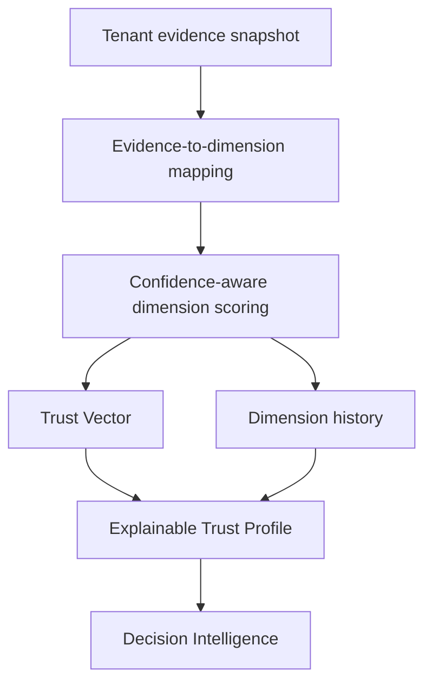

# Trust DNA

Trust DNA is a profile, not one opaque score. It answers which dimensions support trust, how confident each dimension is, what evidence contributed, why the dimension has its current value, and how it changed.

## Dimensions

| Dimension | Typical evidence |
| --- | --- |
| Identity | Human, passport, email, phone, biometric, liveness |
| Device | Device, browser, VPN |
| Behaviour | Browser, location, prior risk decisions |
| Location | Location and VPN observations |
| Document | Passport and driving licence |
| Communication | Email, phone, corporate domain |
| Enterprise | Domain, policy and manual review |
| Historical | Manual review and prior decisions |
| AI | AI agent and deepfake analysis |
| Human | Human, document, biometric, liveness and deepfake analysis |

Each `TrustDimension` contains `score`, `confidence`, `weight`, `reasons`, `evidenceIds`, and bounded `history`. Unsupported dimensions remain at zero confidence and carry `EVIDENCE_MISSING`; they are never silently treated as trusted.

## Scoring semantics

- Scores are bounded to 0–100.
- Evidence confidence is bounded to 0–1.
- Valid current evidence contributes positively.
- inconclusive evidence contributes limited support.
- expired evidence is degraded.
- rejected or revoked evidence contributes no positive trust.
- Overall confidence expresses evidence coverage and quality, not certainty.
- The risk band is a readable summary; the vector and reasons remain the primary output.

The engine is deterministic for the same evidence snapshot and generated timestamp. The API derives a deterministic profile ID from tenant, identity, and sorted evidence identifiers.

## Persistence

`trust_profiles` stores immutable profile snapshots. `trust_dimensions` stores each dimension. `trust_history` records profile creation, increases, reductions, restoration, revocation, decisions, and attributable overrides. `persist_trust_profile_v1` is service-role only and atomic.

Trust DNA never bypasses the existing Trust State Engine or RLS.
