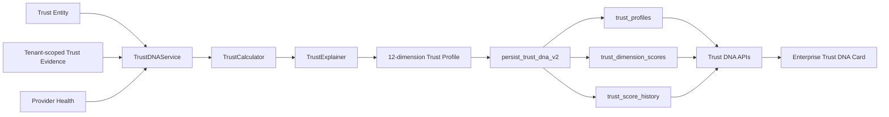

# Trust DNA™ Engine

Trust DNA is an explainable, multi-dimensional projection of evidence retained in the Enterprise Trust Graph. It supports Humans, AI Agents, Devices and Organisations without turning a score into authentication, authorization, surveillance or an autonomous decision.

## Architecture



Reads use the authenticated Supabase client and remain subject to tenant RLS. Recalculation loads evidence through RLS, then persists one immutable profile, its dimensions and its history entry through the service-role-only `persist_trust_dna_v2` transaction.

The earlier Trust Intelligence `build()` contract remains available for non-UUID legacy identities. Enterprise Trust Graph entities use `calculate()` and `recalculate()` with the `trust-dna-v2` profile schema.

## Scoring model

Each dimension returns:

- `score`: evidence outcome strength from 0–100.
- `confidence`: provider-health-adjusted evidence confidence from 0–100.
- `weight`: entity-type-aware normalized contribution.
- `reason`: a concise explanation of evidence quantity, types and outcome.
- `lastUpdated`: the newest contributing evidence timestamp.
- evidence identifiers, missing-evidence state, risk indicators and recommended actions.

The overall score is the weighted mean across all twelve dimensions:

```text
overall score = Σ(dimension score × normalized weight)
confidence = Σ(dimension confidence × normalized weight)
evidence completeness = Σ(weights with evidence) ÷ Σ(all weights) × 100
```

Missing evidence has zero score and zero confidence. It remains visible in `evidenceMissing` and produces a recommended collection or refresh action. Supported dimensions are never renormalized to hide gaps. Provider health reduces confidence, not the evidence outcome itself.

Entity-specific adjustments increase the relevance of identity and documents for Humans, behaviour and AI behaviour for AI Agents, device and network signals for Devices, and enterprise and historical context for Organisations. Final weights are normalized to one.

## Dimension definitions

| Dimension | Typical Enterprise Trust Graph evidence |
| --- | --- |
| Identity | Identity, human, KYC, biometric and liveness evidence |
| Documents | Passports, licences, credentials and certificates |
| Email | Email ownership, mailbox and domain evidence |
| Phone | Phone, mobile, SMS and telecom evidence |
| Device | Device, browser, hardware, endpoint and fingerprint evidence |
| Location | Country, region, travel and geolocation evidence |
| Behaviour | Sessions, activity, interaction, anomaly and risk decisions |
| Network | Network, VPN, proxy, IP, ASN and connection evidence |
| Enterprise | Organisation, employment, corporate and policy evidence |
| Historical | Prior decisions, audits, manual review and history |
| AI Behaviour | AI agents, models, prompts, autonomy and deepfake evidence |
| Provider Confidence | All provider-backed evidence plus current provider health |

Evidence metadata is restricted to the EPIC 21 safe scalar model. Raw documents, email addresses, phone numbers, credentials, tokens and provider payloads are not scoring inputs.

## Version history

`trust_profiles` stores immutable profile versions and links each version to its Enterprise Trust Graph entity and previous profile. `trust_dimension_scores` stores the twelve explained dimension results. `trust_score_history` records the score change, confidence, completeness, evidence references and calculation reason.

Optimistic sequencing is enforced in the database. A recalculation must be exactly one version after the latest retained profile. Profile, dimensions and history are committed atomically.

## API examples

All endpoints require an authenticated enterprise context. Responses are private, correlation-aware and never cached.

### Read current Trust DNA

```http
GET /api/trust-dna/11111111-1111-4111-8111-111111111111
X-Enterprise-Id: aaaaaaaa-aaaa-4aaa-8aaa-aaaaaaaaaaaa
```

The response includes `overallScore`, `dimensionBreakdown`, `overallConfidence`, `evidenceUsed`, `evidenceMissing`, `riskIndicators`, `recommendedActions`, `version` and `lastRecalculated`. When no persisted profile exists, the API returns an explainable preview with `persisted: false`.

### Read score history

```http
GET /api/trust-dna/11111111-1111-4111-8111-111111111111/history?limit=50
X-Enterprise-Id: aaaaaaaa-aaaa-4aaa-8aaa-aaaaaaaaaaaa
```

### Recalculate

Owners, administrators and reviewers may request a recalculation:

```http
POST /api/trust-dna/recalculate
Content-Type: application/json
Origin: https://app.example.com
X-Enterprise-Id: aaaaaaaa-aaaa-4aaa-8aaa-aaaaaaaaaaaa

{
  "entityId": "11111111-1111-4111-8111-111111111111"
}
```

The server derives tenant, actor, evidence, provider state and version. Callers cannot submit their own score or evidence snapshot.

## Security boundaries

- Every read is constrained by authenticated tenant RLS.
- Direct authenticated writes to profiles, dimensions and history are denied.
- Recalculation requires owner, administrator or reviewer role and same-origin JSON.
- Persistence validates that the entity exists in the same tenant and is not deleted.
- Profiles, dimensions and history are append-only.
- Cross-tenant evidence is discarded defensively by the engine even after RLS.
- Scores are decision context only; policy and authorization engines remain authoritative.
- Error responses omit database and provider details.

## Future roadmap

- Calibrated dimension weights from approved, versioned enterprise policy packages.
- Evidence freshness and expiry decay based on documented provider semantics.
- Outbox events for recalculation requests and asynchronous large-graph processing.
- Portfolio distributions and drift alerts with minimum-cohort privacy thresholds.
- Reviewer comparison views for profile-version explanations.
- Deployment-specific calibration and fairness validation before any automated reliance.
