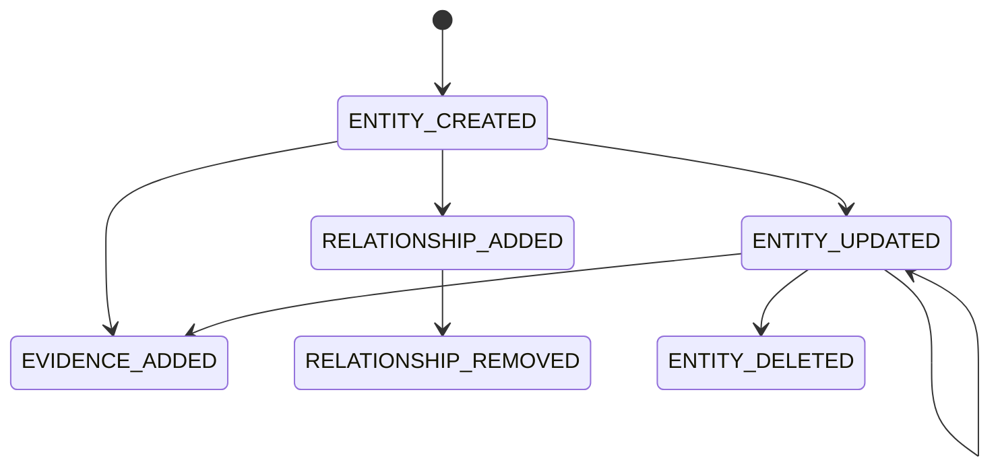

# Trust Domain

## Modules

| Module | Contract |
| --- | --- |
| `types` | Versioned entity, evidence, relationship, source, graph, summary, timeline, and statistics types |
| `entities` | Entity validation, safe metadata, creation/update inputs |
| `graph` | `EvidenceGraphService`, `TrustGraphService`, bounded reads, mutation orchestration |
| `repositories` | Atomic persistence and bounded tenant query interface |
| `providers` | Provider-neutral verification, health, confidence, latency and cost |
| `events` | Immutable mutation event vocabulary |
| `queries` | Shared device/email, provider failure, AI-agent and orphan queries |
| `policies` | Non-scoring rule evaluation foundation |
| `evidence`, `dna`, `replay`, `signals`, `timeline`, `intelligence` | EPIC 20 evidence and explainability architecture |

Every module has a local README defining its responsibility and prohibited behavior.

## Entities

Supported types are `HUMAN`, `ORGANISATION`, `AI_AGENT`, `DEVICE`, `IDENTITY`, `EMAIL`, `PHONE`, `DOCUMENT`, `WORKFLOW`, and `POLICY`.

Statuses are `ACTIVE`, `SUSPENDED`, `REVOKED`, and `DELETED`. Deleted records remain addressable for historical events but are excluded from active neighbour and query results.

Metadata is scalar-only and removes keys associated with addresses, credentials, documents, email, IP, passwords, raw payloads, phone numbers, secrets, and tokens. Sensitive evidence remains in its existing authoritative encrypted boundary.

## Events

The event vocabulary is:

- `ENTITY_CREATED`
- `ENTITY_UPDATED`
- `ENTITY_DELETED`
- `EVIDENCE_ADDED`
- `RELATIONSHIP_ADDED`
- `RELATIONSHIP_REMOVED`
- `PROVIDER_UPDATED`

Events cannot be updated or deleted.

## Provider normalization

`TrustProvider` requires `verify()`, `health()`, `confidence()`, `cost()`, and `latency()`. `providerResultToTrustEvidence()` converts normalized provider output into the graph evidence contract. Provider attributes and provider-specific objects do not cross that boundary.

Unavailable, misconfigured, expired, rejected, or inconclusive results retain those states. Normalization does not promote them to positive evidence.

## Query semantics

`TrustGraphQueries` exposes:

- entities using a device fingerprint hash;
- entities sharing an email hash;
- all evidence for an identity entity;
- provider failures;
- linked AI agents;
- orphan entities.

Queries are bounded and tenant-scoped. They produce read models only and never change Trust State.

## Policy foundation

`TrustPolicyEvaluator` supports `EQUALS`, `NOT_EQUALS`, `IN`, and `EXISTS`. A policy returns `ALLOW`, `DENY`, `REVIEW`, or `NOT_APPLICABLE`, plus the result of every rule. EPIC 21 deliberately adds no policy scoring.
