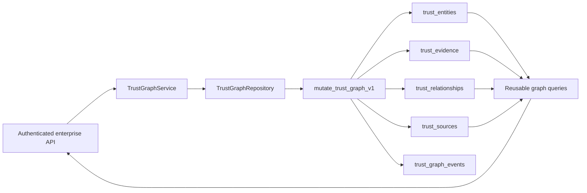
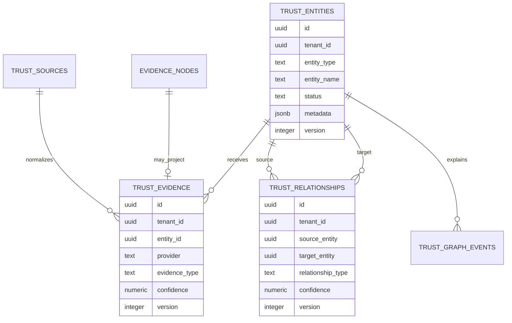

# Enterprise Trust Graph

## Purpose

The Enterprise Trust Graph is the versioned topology core for humans, organisations, AI agents, devices, identities, communication identifiers, documents, workflows, policies, evidence, providers, and their relationships.

It extends the EPIC 20 Trust Intelligence architecture. It does not replace canonical evidence, authentication, RLS, provider adapters, the Trust State Engine, Replay, or Trust DNA.

## Architecture

Mutations are authenticated with existing enterprise membership, restricted by role, protected by same-origin/content controls, executed through one service-role database function, and committed with an immutable event in the same transaction.

## Entity model

## Versioning and history

- Entities begin at version 1.
- Entity updates require `expectedVersion`; stale writes fail with a conflict.
- Entity deletion writes a `DELETED` tombstone. Active relationships must be removed first.
- Relationships are removed by setting `removed_at` and incrementing their version.
- Evidence and graph events are append-only.
- Provider health updates are version checked.
- Every mutation writes `TrustEvent` with actor, resource, version, timestamp, metadata, and correlation ID.

## Tenant isolation

Every table includes `tenant_id`. Composite tenant foreign keys bind evidence and both relationship endpoints to the same tenant. RLS policies use `user_can_access_trust_workspace(tenant_id)`. Anonymous access and authenticated writes are revoked.

The service filters repository results by tenant again before returning graph data. Shared email and device queries accept SHA-256 match keys only; raw identifiers are not query keys.

## Performance

Neighbour lookup uses two bounded queries: one relationship query and one `IN` entity query. Timeline event/evidence reads run in parallel. Summary, statistics, and orphan queries execute as aggregate database functions. API limits are bounded to 500.

Indexes cover tenant/type/status entities, entity/provider evidence, hashed match keys, both relationship directions, provider health, entity events, resources, and correlations.

The local performance test returns a 500-neighbour graph with a single repository neighbour call and a one-second ceiling. This is a process-local architectural guard, not a production SLA.

## Extension points

- New entity types require a domain type, database constraint migration, and tests.
- New relationship types use the uppercase versioned relationship vocabulary.
- Provider adapters normalize through `TrustProvider` and `providerResultToTrustEvidence`.
- Additional graph queries belong in `TrustGraphQueries`, not route-local data access.
- Future streaming consumers can subscribe to `trust_graph_events` through an audited outbox without changing graph mutation semantics.
