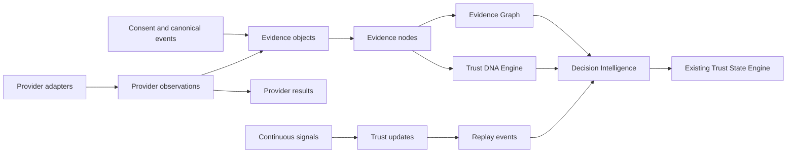

# Trust Intelligence Engine

## Purpose

Trust Intelligence is the permanent explainability layer above Cyber Sentinels' canonical evidence, Trust State, consent, consensus, continuous runtime, and provider systems. It turns retained verification facts into tenant-scoped evidence graphs, multidimensional Trust DNA, replayable timelines, continuous updates, and decision explanations.

It does not replace authentication, RLS, the canonical evidence ledger, or the Trust State Engine. A Trust Intelligence output is an evidence-backed decision input; only existing authorized mutation boundaries can change authoritative trust state.

## Architecture

## Module boundaries

| Module | Responsibility | Must not do |
| --- | --- | --- |
| `evidence` | Normalize and validate evidence contracts | Store raw secrets or authorize access |
| `graph` | Build bounded tenant graph/history views | Infer cross-tenant edges |
| `dna` | Produce ten explainable dimensions | Collapse trust into an unexplained score |
| `replay` | Deterministically order immutable events | Rewrite historical outcomes |
| `signals` | Validate and weight continuous inputs | Directly mutate authoritative Trust State |
| `providers` | Normalize provider verification, health, cost and latency | Treat unavailable providers as positive evidence |
| `intelligence` | Explain decisions and overrides | Bypass policy or authentication |
| `scoring` | Deterministic confidence-aware math | Read persistence or environment state |
| `timeline` | Compose evidence, updates and replay chronology | Invent missing events |
| `sdk` | Stable transport-neutral client contracts | Claim GraphQL/generated clients ship in EPIC 20 |

## API security

All new reads require an authenticated user and a valid `X-Enterprise-Id` header. Enterprise membership and role are resolved through the existing identity enterprise context. Responses are `private, no-store`, carry correlation identifiers, validate references, bound collection reads to 500 records, and suppress internal errors.

| Method | Route | Result |
| --- | --- | --- |
| GET | `/api/evidence/{id}` | One normalized evidence node |
| GET | `/api/evidence/graph/{identity}` | Bounded graph |
| GET | `/api/evidence/history/{identity}` | Chronological evidence |
| GET | `/api/trust-dna/{identity}` | Current explainable profile |
| GET | `/api/replay/{identity}` | Replay timeline; legacy replay IDs remain supported |
| GET | `/api/trust-intelligence/decision/{identity}` | Explainable current decision input |

## Persistence flow

The EPIC 20 migration projects existing and future `evidence_objects` into `evidence_nodes`, and provider observations into normalized `provider_results`. Projection metadata contains assurance and verification flags only—never raw provider payloads.

New history tables are append-only. Direct anonymous access and authenticated writes are revoked. Tenant reads use `user_can_access_trust_workspace(tenant_id)`. Composite tenant foreign keys prevent cross-tenant graph, profile, and signal relationships even through service code.

Service-role functions atomically persist Trust DNA profiles and signal/update/replay projections. Those functions explicitly do not mutate `subject_trust_state`.

## Operational boundaries

- Migration deployment and live RLS verification are release activities, not performed by this repository change.
- Provider cost and latency fields are nullable until measured by a real adapter.
- Missing Trust DNA dimensions remain visible as `EVIDENCE_MISSING`.
- Human overrides require actor, reason, decision, and timestamp attribution.
- API pagination beyond the bounded first 500 records is a future compatible extension.
