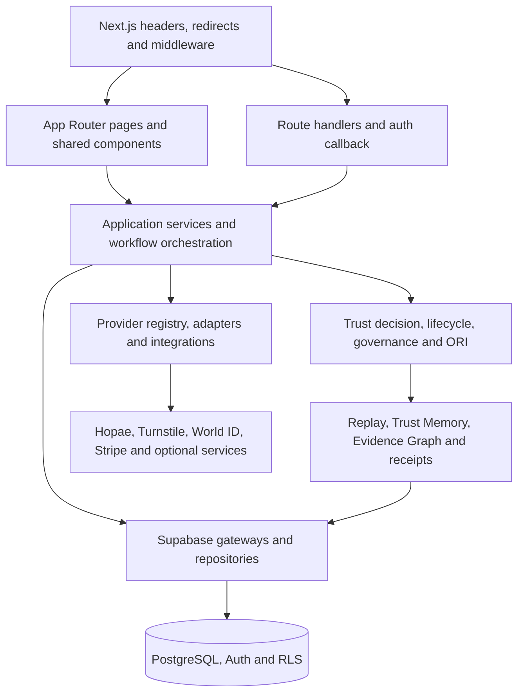

# System overview

Baseline commit: `9b6fecf`

Architecture discovery date: 2026-07-18

## System shape

Cyber Sentinels is a Next.js App Router application that combines public product surfaces, authenticated workspaces, protected administrative operations, server route handlers, domain orchestration, external provider adapters and Supabase persistence.

The diagram is the target dependency direction. Current Server Components and route handlers often call `lib/supabase` directly; that is recorded migration debt, not a reason to misrepresent the present code or perform an unapproved refactor.

## Application layers

| Layer | Current locations | Responsibility |
| --- | --- | --- |
| Edge and routing | `next.config.mjs`, `middleware.ts` | Redirects, security headers, route classification, auth refresh and protected-access gates |
| Presentation | `app/**/page.tsx`, `components/` | Semantic rendering, interaction and route-bound composition |
| HTTP/API | `app/api/**/route.ts`, `app/auth/callback/route.ts` | Request validation, authentication, authorization, response contracts and delegation |
| Application orchestration | `lib/core/`, `lib/runtime/`, `lib/workflows/` | Use-case coordination, lifecycle execution and workflow sequencing |
| Trust domain | `lib/trust/`, `lib/trust-engine/`, `lib/trust-explanation/`, `lib/governance/` | Authoritative decisions, enforcement, review and explanation |
| Operational risk | `lib/operational-risk/` | Off/shadow/advisory risk inference after the authoritative decision |
| Evidence continuity | `lib/replay/`, `lib/trust-memory/`, `lib/evidence-graph/`, `lib/trust-receipts/` | Chronology, append-only context, relationships and portable evidence |
| Providers | `lib/providers/`, `lib/identity-providers/`, `lib/detection/providers/`, `lib/integrations/` | Registry, adapters, normalization, callbacks, health and safe failure |
| Data access | `lib/supabase/` and current route/page queries | Cookie-aware, browser, server and service-role Supabase access |
| Persistence | `supabase/migrations/` | PostgreSQL schema, constraints, indexes, audit records and RLS |
| Quality and operations | `tests/`, `scripts/`, `docs/` | Automated gates, diagnostics, operational evidence and runbooks |

## App Router

The baseline contains 225 pages, 121 route handlers and three layouts. The root layout owns global metadata and navigation access state. Enterprise routes share `app/enterprise/layout.tsx`. Founder-control has a nested layout. A normalized route audit found no page or handler collisions and no duplicate layout scopes.

Public, authenticated, administrative, internal-tooling and experimental routes coexist. Canonical visibility and middleware classification must remain aligned; a route being buildable does not make it public.

## Authentication and authorization

Supabase Auth provides account authentication and cookie-backed sessions.

1. Browser auth uses `lib/supabase/client.ts`.
2. Server rendering and route handlers use `lib/supabase/server.ts`.
3. The auth callback exchanges an authorization code for a session and validates the redirect path.
4. Middleware resolves the server-authenticated user and requires email verification for protected paths.
5. Admin access additionally requires a configured email allowlist and a verified-admin cookie.
6. Service-role access is isolated in `lib/supabase/service-role.ts` and marked server-only.

Authentication proves the account session. Domain authorization, trust policy and workflow authority remain separate decisions.

## API routes

The 121 route handlers cover authentication, providers, evidence, workflows, governance, billing, trust, validation and administrative operations. Route handlers are responsible for:

- request size, shape and content validation;
- authentication and tenant derivation;
- authorization before sensitive execution;
- idempotency and replay protection where required;
- normalized error responses;
- audit and correlation references;
- calling domain services rather than embedding new business policy.

Signed provider webhooks authenticate at their route boundary and are not treated as browser sessions.

## Middleware

There is exactly one middleware entrypoint. It refreshes Supabase auth, gates protected route classes, requires verified email, enforces admin allowlisting and verification, fails unavailable protected surfaces safely, and prevents indexing/caching of protected responses.

Middleware is a coarse access boundary. Sensitive pages and route handlers retain server-side checks so middleware is not the only authorization control.

## Supabase and persistence

The repository contains 58 ordered migration files. Migrations define schema history, constraints and RLS policies. The presence of a migration file does not prove it is applied in Preview or Production.

Current data access is mixed:

- centralized client creation under `lib/supabase`;
- direct queries from Server Components and route handlers;
- domain-specific persistence behavior in orchestration modules;
- service-role writes for privileged server workflows.

The adopted dependency rule is that repositories own persistence. Migration toward repositories must be incremental, tested and separately authorized; Part 1 changes documentation only.

## Provider layer

The canonical verification registry is `lib/providers/registry.ts`. It contains nine unique IDs across identity, proof-of-personhood, bot protection, device risk and future adapters. Provider configuration, implementation and runtime states are separate.

`IdentityProviderAdapter` defines session creation, retrieval, callback verification, evidence normalization and health checks. Hopae is the implemented identity adapter. Other registry entries remain safely disabled, placeholder or configured-unverified as declared. External provider evidence never authorizes directly.

## Trust execution

`lib/runtime/trust-execution-pipeline.ts` coordinates signal checks, the trust algorithm, workflow execution, posture, governance queueing, events, performance profiling, cache and optional ORI processing. `lib/core/trust-lifecycle-orchestrator.ts` provides the canonical lifecycle model and authorization/enforcement sequencing.

The Trust Decision remains authoritative. ORI runs only after that decision in off, shadow or advisory mode and reports `authoritativeDecisionUnchanged: true`.

## Evidence continuity

- Replay writes chronological events and exposes pending-write diagnostics.
- Trust Memory models append-only context and validates chronology, linkage and attribution.
- Evidence Graph relates normalized evidence, Replay, Trust Memory, governance, providers and validation.
- Receipts and evidence packs provide bounded portable representations.

These layers explain and retain decision context; they do not manufacture missing evidence or replace source records.

## Current architecture gaps

- No root `services/` directory or consistent application-service layer exists.
- A dedicated repository abstraction is not consistently present.
- Many Server Components query through `lib/supabase` directly.
- Two API routes import the Supabase SDK directly instead of the canonical gateway.
- Node and package-manager versions are not pinned in the repository.
- Cloudflare edge deployment configuration is not represented in source; Turnstile integration is present.

These gaps are recorded for future architecture work. They are not silently fixed by this foundation Codex.
