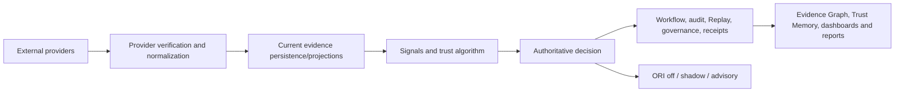

# Trust architecture implementation review

Baseline commit: `77588a5`

Review date: 2026-07-18

Scope: CS-ENG-001 Part 3, documentation-only architecture audit

## Executive finding

Cyber Sentinels has substantive trust-domain building blocks: provider attribution, signed callback handling, normalized evidence, deterministic scoring, evidence/replay/governance continuity, Trust Memory modelling, Evidence Graph queries, ORI abstention/versioning and honest platform health. The current implementation is not yet the permanent linear pipeline described by the blueprint.

The most important sequencing difference is that ORI runs after the authoritative decision and cannot change it. This is a safe current boundary while ORI validation is incomplete. “Exact replay,” one universal immutable evidence envelope and a completely version-pinned TDE decision record remain target capabilities.

## Current and target pipeline



Target convergence keeps the blueprint stages but preserves authority:

```text
Providers -> Normalizer -> immutable Evidence Store -> Evidence Graph
          -> versioned Replay/Trust Memory -> validated ORI recommendation
          -> versioned TDE + policy/authority -> enforcement
          -> dashboard/report/audit API
```

ORI remains advisory even when moved before TDE. Policy and authority remain mandatory before execution.

## Strengths

- Canonical provider registry separates implementation, configuration and health; inactive providers fail closed.
- Hopae callbacks verify HMAC/timestamp before normalization and store digest-only normalized evidence.
- Trust scoring is deterministic, explains signal weights/decay and preserves limitations.
- Missing evidence has an explicit insufficient state; provider/ML evidence is not declared autonomous truth.
- Workflow execution preserves evidence, audit, Replay and governance context and records reviewer override.
- Timeline migration source enforces append-only update/delete prevention.
- Evidence Graph and Trust Memory have explicit typed models and integrity validators.
- ORI versions features/model/dataset/thresholds, verifies artifact hash, can abstain and requires reviewed non-synthetic data for metrics.
- Reports use bounded language and keep missing references explicit.
- Platform health distinguishes configuration from a real provider health sample and missing telemetry from zero.

## Weaknesses and gaps

- Provider contract lacks blueprint `initialize()` and `shutdown()` lifecycle hooks.
- Generic and provider evidence normalizers are separate shapes; validation/hashing/idempotency are not universal.
- Canonical evidence immutability is not enforced across every table.
- Evidence Graph is a rebuildable in-memory projection and lacks several requested edge types and dedicated device/session nodes.
- Replay reconstructs operational history but does not pin every policy/configuration/model/Trust Memory version for exact re-execution.
- Trust Memory lacks one universal durable event/snapshot registry.
- ORI input coverage is narrow and runs post-decision; reviewed validation evidence is insufficient for production claims.
- TDE has current internal states that do not map one-to-one to target Reject/Suspend/Expire semantics.
- Complete Decision ID/version/replay/memory/ORI/policy envelope is not universal.
- Some decision side effects are asynchronous; replay/queue diagnostics can be process-local.
- Multiple legacy trust/calculation paths create ownership and drift risk.

## Single points of failure

| Area | Risk | Mitigation direction |
| --- | --- | --- |
| Hopae as only implemented identity adapter | Provider outage/configuration blocks provider-backed identity evidence | Preserve fail-closed behavior; add an approved adapter only after full contract/security tests |
| Process-local replay retry diagnostics | Restart can lose operational retry visibility | Durable idempotent queue, dead-letter state, reconciliation and alerting |
| Supabase/PostgreSQL persistence | Evidence, Replay and governance depend on one data plane | Tested backups/restores, regional/recovery objectives and integrity verification |
| Runtime pipeline ownership | One orchestrator coordinates many critical side effects | Transaction/outbox boundaries and resumable idempotent stages |
| Trust algorithm defaults/configuration | Unversioned change can prevent exact replay | Persist engine/tuning/config version and immutable decision input manifest |
| Service-role paths | RLS bypass increases blast radius | Narrow server-only functions, tenant assertions and privileged-access audit |

## Scalability outlook

The current typed in-process models are appropriate for bounded pilot workloads and keep semantics inspectable. Scaling should follow measured pressure:

- use durable outbox/queue processing for graph, Replay, report and telemetry projections;
- partition high-volume chronology by tenant/time only after query evidence supports it;
- keep normalized PostgreSQL records authoritative and make graph/search projections rebuildable;
- cache immutable versioned artifacts, never mutable authorization outcomes;
- batch provider retrieval only within rate limits and idempotency contracts; and
- add distributed tracing and retained metrics without copying evidence payloads.

Introducing new infrastructure before consistency, tenancy and recovery contracts are defined would create more sources of truth.

## Prioritized recommendations

### Critical contract work

1. Define and persist the versioned TDE decision envelope and exact Replay manifest.
2. Establish one canonical immutable evidence envelope with database uniqueness, tenant scope and correction semantics.
3. Make Replay writes durable, idempotent and reconcilable before relying on complete audit chronology.
4. Verify deployed RLS, encryption, provider secrets and append-only controls in every environment.

### High priority

5. Consolidate canonical trust-engine ownership and label/deprecate legacy calculation paths.
6. Add durable Trust Memory snapshot versions and required Evidence Graph relationships.
7. Add policy-evaluation and ORI-latency instrumentation with safe correlation.
8. Complete report coverage for policy, ORI, engine version, risk and decision integrity.

### Controlled future work

9. Evolve the provider lifecycle through a compatibility ADR, not a breaking rewrite.
10. Validate ORI on reviewed representative outcomes; keep off/shadow/advisory until promotion approval.
11. Move ORI before TDE only as a versioned advisory input with rollback and unchanged authority boundaries.
12. Consider a graph datastore or streaming projection only after measured query/volume needs.

## Acceptance conclusion

The provider, normalization, store, graph, Replay, Trust Memory, ORI, TDE, report, observability and security architectures are now documented with current implementation evidence and explicit target gaps. This review does not modify production code, schema or policy and does not certify deployed controls.
